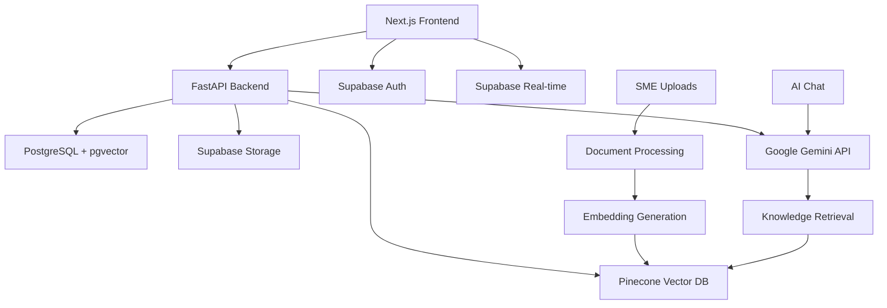
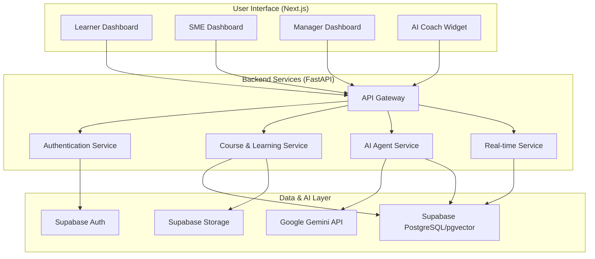

# K-Orbit: AI-Powered Corporate Onboarding, Learning & Knowledge Hub 🚀

**Transform your organization's learning culture with K-Orbit—an intelligent, enterprise-ready platform designed for modern teams.**

K-Orbit is a modern comprehensive onboarding, learning and knowledge management system powered by AI. It combines a rich, interactive learning environment with a powerful, semantic knowledge base to create a seamless and engaging experience for employees. From personalized onboarding paths to an AI-powered coach that answers questions in real-time, K-Orbit is built to foster growth, collaboration, and efficiency for new hires, project hires and more.

**This project is production-ready, fully implemented, and optimized for team development with modern AI tools like primarly Cursor and also GitHub Copilot.**

## ✨ Core Features

K-Orbit is built on a modular, feature-rich architecture that caters to the diverse needs of a modern organization.

| Feature Area | Description | Status |
| :--- | :--- | :--- |
| 🤖 **AI Coach** | A floating, globally accessible chat assistant powered by **Google Gemini**. It provides intelligent, context-aware answers by searching the organization's private knowledge base, with full source attribution. | ✅ Complete |
| 📁 **Knowledge Hub** | A centralized repository for all company documents (PDFs, DOCX, etc.). SMEs can easily upload content, which is automatically processed, indexed, and made searchable via a beautiful document viewer. | ✅ Complete |
| 🧠 **AI-Powered Learning** | Beyond simple Q&A, the AI generates personalized learning paths based on an employee's role and goals, and can even create quizzes from existing documents to reinforce learning. | ✅ Complete |
| 🎮 **Gamification Engine** | A sophisticated system to drive engagement. Users earn XP, unlock achievement badges for milestones, and can see their progress on leaderboards, fostering a culture of continuous learning. | ✅ Complete |
| 📚 **Interactive Courses** | A complete course management system supporting rich content like videos, documents, and quizzes. It includes detailed progress tracking and adaptive assessments. | ✅ Complete |
| 👥 **Role-Based Access** | Tailored dashboards and permissions for every role: **Learners** get a personalized journey, **SMEs** manage content, and **Managers** oversee team progress with analytics. | ✅ Complete |
| ⚡ **Real-Time System** | Built-in support for **WebSockets** enables live notifications, real-time progress updates, and instant announcements pushed from managers to specific user groups. | ✅ Complete |
| 📊 **Advanced Analytics**| A dedicated analytics module tracks learning engagement, course completion rates, and knowledge retention, providing actionable insights for managers and admins. | ✅ Complete |

## 🏗️ Technical Architecture

K-Orbit is built with a modern, scalable, and secure technology stack, designed for performance and maintainability.

### Technology Stack

| Component | Technology | Purpose |
| :--- | :--- | :--- |
| **Frontend** | **Next.js 14 (App Router), TypeScript, Tailwind CSS** | A modern, type-safe, and beautifully designed user interface. |
| **UI/UX** | **shadcn/ui, Lucide Icons, Glassmorphism** | Accessible, reusable components with a clean, futuristic aesthetic. |
| **State Management**| **React Query & Zustand** | Efficient server state caching and lightweight global client state. |
| **Backend** | **FastAPI (Python)** | A high-performance, asynchronous API for all business logic. |
| **Database** | **Supabase (PostgreSQL with pgvector)** | Handles authentication, storage, real-time events, and vector similarity search. |
| **AI Engine** | **Google Gemini & Gemini Embeddings** | Powers the conversational AI coach and semantic search capabilities via direct Google APIs. |
| **Real-time**| **WebSockets**| Enables live notifications, progress tracking, and announcements. |
| **Deployment** | **Docker, Render, Azure App Service** | Containerized for local development and ready for production deployment on modern cloud platforms. |

### Simple V1 Design



### System Final Architecture Diagram




## 🚀 Getting Started

Setting up K-Orbit is straightforward. Follow these steps to get your local development environment running.

### Prerequisites
- **Node.js** (v18.0.0 or higher)
- **Python** (v3.11 or higher)
- **Docker** (Recommended for easy, consistent setup)
- **Supabase Account**
- **Google Gemini API Key**

### 1. Clone the Repository
```bash
git clone https://github.com/your-org/k-orbit.git
cd k-orbit
```

### 2. Configure Environment Variables
Copy the example environment file and fill in your credentials.
```bash
cp env.example .env
nano .env
```
You will need to add your API keys from Supabase and Google AI Studio. Also review `env.example` for all required variables (frontend, backend, Supabase, AI, and deployment) to ensure your environment is complete before running or deploying.

### 3. Set Up the Database
Log in to your Supabase account and perform the following steps:
1.  **Create a new project.**
2.  Navigate to the **SQL Editor**.
3.  Copy the entire contents of `infra/schema.sql` and run it to set up your database tables.
4.  Run the following command in the SQL Editor to enable vector search:
    ```sql
    CREATE EXTENSION IF NOT EXISTS vector;
    ```

### 4. Run the Application

**Option A: With Docker (Recommended)**

The simplest way to start the entire application stack:
```bash
docker-compose up -d
```
The frontend will be available at `http://localhost:3000` and the backend at `http://localhost:8000`.

**Option B: Manual Setup**

If you prefer to run the services manually:

**Backend:**
```bash
cd backend
python -m venv venv
source venv/bin/activate  # On Windows: venv\Scripts\activate
pip install -r requirements.txt
uvicorn app.main:app --reload
```

**Frontend:**
*If you see TypeScript or module errors, they are expected and will be resolved by the `npm install` command.*
```bash
cd frontend
npm install
npm run dev
```

### 5. Verify Your Setup
- **Frontend App**: `http://localhost:3000`
- **Backend API Docs**: `http://localhost:8000/docs`
- **AI Coach**: Log in and click the floating bot icon.

## 📁 Project Structure
The repository is organized into three main directories: `backend`, `frontend`, and `infra`.

```
k-orbit/
├── backend/                # FastAPI application (Python)
│   ├── app/
│   │   ├── main.py         # API entry point
│   │   ├── ai_agent/       # AI chat, embeddings, and content generation
│   │   ├── auth/           # Authentication and authorization logic
│   │   ├── courses/        # Course management and enrollment
│   │   ├── gamification/   # XP, badges, and leaderboards
│   │   ├── resources/      # Document upload and knowledge base
│   │   └── ...             # Other feature modules
│   └── Dockerfile
│
├── frontend/               # Next.js application (TypeScript)
│   ├── app/
│   │   ├── (auth)/         # Login/register pages
│   │   ├── dashboard/      # Role-based dashboards (learner, sme, manager)
│   │   └── api/            # Frontend API routes (server-side handlers)
│   ├── components/
│   │   ├── ai-coach/       # The global AI chat widget
│   │   └── ui/             # Reusable shadcn/ui components
│   └── lib/                # Auth provider, state management, etc.
│
├── infra/                  # Database schema and infrastructure
│   └── schema.sql          # Complete PostgreSQL database schema
│
└── docker-compose.yml      # Docker configuration for local development
```

## 🤝 Team Development & Contribution

K-Orbit is designed for collaborative development, especially with AI-powered tools. The codebase is fully typed, well-documented, and follows established patterns, making it easy for tools like **Cursor** and **GitHub Copilot** to provide accurate and helpful suggestions.

We welcome contributions! Please see our contributing guide for more details on how to get involved.

## 🧰 Technology Stack & Uses
- **Frontend**: Next.js 14 (App Router) for modern routing/SSR/ISR; TypeScript for type safety; Tailwind CSS for utility-first styling; shadcn/ui for accessible UI components; Lucide Icons for consistent iconography.
- **Backend**: FastAPI for high-performance async APIs; Pydantic for validation; Uvicorn as the ASGI server.
- **Database & Auth**: Supabase (PostgreSQL) with Row-Level Security; Supabase Auth for authentication; Supabase Storage for file handling; pgvector for semantic search.
- **AI**: Google Gemini for conversational AI; Gemini Embeddings for semantic search across documents.
- **Real-time**: WebSockets to power live notifications and updates (e.g., announcements, progress).
- **State & Data**: React Query for server state caching/retries; Zustand for lightweight client state.
- **DevOps & Deployment**: Docker and docker-compose for local orchestration; Render/Azure App Service, etc. (frontend and backend) for deployment; GitHub Actions (optional) for CI/CD.
- **Observability**: Structured logging with `structlog`; compatible with Sentry/GA if desired.

## 🔮 Future Enhancements
- **Multimodal AI**: Voice input, image/document understanding, and richer assistant capabilities.
- **Deeper Analytics**: Predictive insights, cohort analysis, and customizable KPIs for teams/orgs.
- **Admin & Manager Dashboards**: Expanded controls, scheduled reports, and policy governance.
- **Integrations**: SSO (Okta/Azure AD/Google), Slack/Teams notifications, LMS/LRS connectors.
- **Mobile & Offline**: PWA improvements, native app shells, and resilient offline learning flows.
- **RAG Improvements**: Advanced chunking, hybrid search, and metadata-weighted retrieval.
- **Security & RBAC**: Fine-grained permissions, audit trails, and org-level policy templates.
- **Accessibility & i18n**: WCAG-conformant interactions and expanded language/localization.